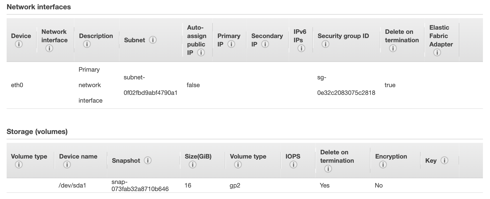

# DOMjudge Docker containers

This directory contains the necessary files to create Docker images which can be used to run DOMjudge

There is one container for running the domserver and one for running a judgehost.

The domserver container contains:

* A setup script that will:
    * Set up or update the database.
    * Set up the webserver.
* PHP-FPM and nginx for running the web interface.
* Scripts for reading the log files of the webserver.

The judgehost container contains a working judgehost with cgroup support and a chroot for running the submissions. C, C++ and Java are currently supported.

These containers do not include MySQL / MariaDB; the [MariaDB](https://hub.docker.com/r/_/mariadb/) Docker container does this better than we ever could.

#### Table of Contents
- [Using the images](#using-the-images)
  - [MariaDB container](#mariadb-container)
  - [DOMserver container](#domserver-container)
    - [Environment variables](#environment-variables)
    - [Passwords through files](#passwords-through-files)
    - [Commands](#commands)
  - [Judgehost container](#judgehost-container)
    - [Environment variables](#environment-variables)
    - [Example AWS Setup](#example-aws-setup)
- [Building the images](#building-the-images)
- [Customizing the image](#customizing-the-image)

## Using the images

These images are available on the [Docker Hub](https://hub.docker.com) as `domjudge/domserver` and `domjudge/judgehost`.

### DOMjudge network
For isolation, create a Docker network which will be used for the communication between DOMjudge-related containers.
```bash
docker network create dj
```

### Traefik container (Optional)
An easy way to get trusted certificates using ACME is running the Traefik reverse proxy in front of the DOMjudge stack. Create a Docker network which allows communication across compose stacks using:

```bash
docker network create proxy_network
```

Now, you can deploy a Traefik reverse proxy. An example test deployment with **insecure** API access on port `8080` can be created using:

```bash
docker run --name traefik --net proxy_network -p 80:80 -p 443:443 -p 8080:8080 -v /letsencrypt -v /var/run/docker.sock:/var/run/docker.sock:ro traefik:v2.10 \
  --api.insecure=true \
  --providers.docker=true \
  --providers.docker.exposedbydefault=false \
  --entrypoints.web.address=:80 \
  --entrypoints.websecure.address=:443 \
  --certificatesresolvers.myresolver.acme.email=your-email@example.com \
  --certificatesresolvers.myresolver.acme.httpchallenge.entrypoint=web \
  --certificatesresolvers.myresolver.acme.storage=/letsencrypt/acme.json
```

This will start a Traefik container listening for http traffic on port `80`, https traffic on port `443`, and listening for Traefik dashboard traffic at port `8080`.
Traefik automatically listens to the Docker socket for running containers with labels defining reverse proxy routes.
It also defines an ACME resolver named `myresolver` which creates a Let's Encrypt ACME account using email address `your-email@example.com` used to create the TLS certificates for https traffic.

### MariaDB container

Before starting the containers, make sure you have a MySQL / MariaDB database somewhere. The easiest way to get one up and running is to use the [MariaDB](https://hub.docker.com/r/_/mariadb/) Docker container:

```bash
docker run -it --name dj-mariadb --net dj -e MYSQL_ROOT_PASSWORD=rootpw -e MYSQL_USER=domjudge -e MYSQL_PASSWORD=djpw -e MYSQL_DATABASE=domjudge -p 13306:3306 mariadb --max-connections=1000
```

This will start a MariaDB container, set the root password to `rootpw`, create a MySQL user named `domjudge` with password `djpw` and create an empty database named `domjudge`. It will also expose the server on port `13306` on your local machine, so you can use your favorite MySQL GUI to connect to it. If you want to save the MySQL data after removing the container, please read the [MariaDB](https://hub.docker.com/r/_/mariadb/) Docker Hub page for more information.

### DOMserver container

Next, if you are on Linux make sure you have cgroups enabled. See the [DOMjudge documentation about setting up a judgehost](https://www.domjudge.org/docs/manual/master/install-judgehost.html#linux-control-groups) for information about how to do this. Docker on Windows and macOS actually use a small Linux VM which already has these options set.

Without the optional Traefik reverse proxy, you can run the domserver using the following command:

```bash
docker run -it --name domserver --net dj -e MYSQL_HOST=dj-mariadb -e MYSQL_USER=domjudge -e MYSQL_DATABASE=domjudge -e MYSQL_PASSWORD=djpw -e MYSQL_ROOT_PASSWORD=rootpw -p 12345:80 domjudge/domserver:latest
```

If you want a specific DOMjudge version instead of the latest, replace `latest` with the DOMjudge version (e.g. `5.3.0`).

The above command will start the container and set up the database. It will then start nginx and PHP-FPM using supervisord.

The initial passwords for the `admin` and `judgehost` users should be printed when starting the domserver, but if not, you can use the following commands to retrieve them:

```bash
docker exec -it domserver cat /opt/domjudge/domserver/etc/initial_admin_password.secret
docker exec -it domserver cat /opt/domjudge/domserver/etc/restapi.secret
```

You can now access the web interface on [http://localhost:12345/](http://localhost:12345/) and log in as admin.

If you lose access to the admin user, see the [DOMjudge documentation on resetting the password](https://www.domjudge.org/docs/manual/master/config-basic.html#resetting-the-password-for-a-user).

Make a note of the password for the `judgehost` user, it will be used when the judgehost container is configured. The password can be changed from the web interface by editing the `judgehost` user.

For a deployment using the Traefik container with ACME on domain `domjudge.example.com`, run domserver using the following command:

```bash
docker create -it --name domserver --net dj -e MYSQL_HOST=dj-mariadb -e MYSQL_USER=domjudge -e MYSQL_DATABASE=domjudge -e MYSQL_PASSWORD=djpw -e MYSQL_ROOT_PASSWORD=rootpw \
  -l "traefik.enable=true" \
  -l "traefik.http.services.domjudge.loadbalancer.server.port=80" \
  -l "traefik.http.routers.domjudge.rule=Host(\`domjudge.example.com\`)" \
  -l "traefik.http.routers.domjudge.entrypoints=web" \
  -l "traefik.http.routers.domjudgesecure.rule=Host(\`domjudge.example.com\`)" \
  -l "traefik.http.routers.domjudgesecure.entrypoints=websecure" \
  -l "traefik.http.routers.domjudgesecure.tls=true" \
  -l "traefik.http.routers.domjudgesecure.tls.certresolver=myresolver" \
  -l "traefik.docker.network=proxy_network" \
  domjudge/domserver:latest
docker network connect proxy_network domserver
docker start -a domserver
```

With DNS configured, you can now access the web interface on [http://domjudge.example.com/](http://domjudge.example.com/) or [https://domjudge.example.com/](https://domjudge.example.com/) and log in as admin.

#### Environment variables

The following environment variables are supported by the `domserver` container:

* `CONTAINER_TIMEZONE` (defaults to `Europe/Amsterdam`): allows you to change the timezone used inside the container.
* `MYSQL_HOST` (defaults to `mariadb`): set the host to connect to for MySQL. Can be hostname or IP.
* `MYSQL_USER` (defaults to `domjudge`): set the user to use for connecting to MySQL.
* `MYSQL_PASSWORD` (defaults to `domjudge`): set the password to use for connecting to MySQL.
* `MYSQL_ROOT_PASSWORD` (defaults to `domjudge`): set the root password to use for connecting to MySQL.
* `MYSQL_DATABASE` (defaults to `domjudge`): set the database to use.
* `DJ_DB_INSTALL_BARE` (defaults to `0`): set to `1` to do a `bare-install` for the database instead of a normal `install`.
* `FPM_MAX_CHILDREN` (defaults to `40`): the maximum number of PHP FPM children to spawn.
* `TRUSTED_PROXIES` (defaults to empty): The IP list of trusted proxy servers, separated by a comma(`,`).
* `WEBAPP_BASEURL` (defaults to `/`): The Base Url of DOMserver. Such as `/domjudge`, You can access the DOMserver homepage via `http://localhost/domjudge`.

#### Passwords through files

In order to not specify sensitive information through environment variables, the variables `MYSQL_PASSWORD_FILE` and `MYSQL_ROOT_PASSWORD_FILE` can be used to set a path to a file to read the passwords from. This is suitable to use together with [docker compose's secrets](https://docs.docker.com/compose/compose-file/#secrets-configuration-reference):

```yml
...
services:
    domserver:
        image: domjudge/domserver:${DOMJUDGE_VERSION}
        secrets:
            - domjudge-mysql-pw
        ...
        environment:
            MYSQL_PASSWORD_FILE: /run/secrets/domjudge-mysql-pw
        ...
```

#### Commands

The `domserver` container supports a few commands. You can run all commands using the following syntax:

```bash
docker exec -it domserver [command]
```

If you have named your container something other than `domserver`, be sure to change it in the command as well.

The following commands are available:

* `nginx-access-log`: tail the access log of nginx.
* `nginx-error-log`: tail the error log of nginx.
* `symfony-log`: for DOMjudge using Symfony (i.e. 6.x and higher), tail the symfony log.

Of course, you can always run `docker exec -it domserver bash` to get a bash shell inside the container.

To restart any of the services, run the following:

```bash
docker exec -it domserver supervisorctl restart [service]
```

where `[service]` is one of `nginx` or `php`.

#### Docker-compose
See https://github.com/DOMjudge/domjudge-packaging/blob/main/docker/docker-compose.yml for a docker-compose example which automates the steps above.
When using the optional Traefik reverse proxy, deploy the stack defined in https://github.com/DOMjudge/domjudge-packaging/blob/main/docker/docker-compose-traefik.yml first and uncomment the relevant lines in the `docker-compose.yml` file.

### Judgehost container

To run a single judgehost, run the following command:

```bash
docker run -it --privileged -v /sys/fs/cgroup:/sys/fs/cgroup --name judgehost-0 --net dj --hostname judgedaemon-0 -e DAEMON_ID=0 domjudge/judgehost:latest
```

Again, replace `latest` with a specific version if desired. Make sure the version matches the version of the domserver.

This will start up a judgehost that is locked to the first CPU core of your machine.

If the judgedaemon stops for whatever reason, you should be able to see the error it produced in the shell where you started the judgehost. If you want to restart the judgehost, run `docker start judgehost-0`, where `judgehost-0` is the value you passed to `--name` in the `docker run` command.

#### Environment variables

The following environment variables are supported by the `judgehost` container:

* `CONTAINER_TIMEZONE` (defaults to `Europe/Amsterdam`): allows you to change the timezone used inside the container.
* `DOMSERVER_BASEURL` (defaults to `http://domserver/`): base URL where the domserver can be found. The judgehost uses this to connect to the API. **Do not add `api` yourself, as the container will do this!**
* `JUDGEDAEMON_USERNAME` (defaults to `judgehost`): username used to connect to the API.
* `JUDGEDAEMON_PASSWORD` (defaults to `password`): password used to connect to the API. This should be the password displayed for the `judgehost` user when the `domserver` container was started. Like with the mysql passwords, you can also set `JUDGEDAEMON_PASSWORD_FILE` to a path containing the password instead.
* `DAEMON_ID` (defaults to `0`): ID of the daemon to use for this judgedaemon. If you start multiple judgehosts on one (physical) machine, make sure each one has a different `DAEMON_ID`.
* `DOMJUDGE_CREATE_WRITABLE_TEMP_DIR` (defaults to `0`): if set to 1, a writable temporary directory will be created for submissions. This only works for DOMjudge versions >= 6.1.
* `RUN_USER_UID_GID` (defaults to `62860`): UID/GID of the user that will submissions. Make sure this UID/GID is **not** used on your host OS.

#### Example AWS Setup

The [BAPC 2019 contest](https://2019.bapc.eu) used AWS EC2 to create judgehost workers. Thanks to Guillaume Derval—who also used AWS for the 2018 contest—we were able to create new judgehost instances with just one command. If you're using AWS to run the judgings during a contest, make sure to test all problems against the AWS environment as well. Testing against the live environment is always smart, but with AWS the performance can vary more than with dedicated hardware.

The command is as follows, it uses the [AWS cli tool](https://github.com/aws/aws-cli):
```bash
aws ec2 run-instances --launch-template LaunchTemplateId=$LAUNCH_TEMPLATE_ID,Version=2 --count 1 --cpu-options CoreCount=1,ThreadsPerCore=1 --user-data file://bapc-user-data.sh
```

This makes use of a launch template, which contains all of the instance settings that we used—except for the cpu-options, which a template cannot store. It is recommended to create the template by first setting up a judgehost manually yourself using the web interface for example, with the instance settings that you want to use. This way you can setup the network and actually test it before templating it. For reference, BAPC 2019 used the following template:



The user-data file is a script that will run one time when the instance is first booted. BAPC 2019 used a Ubuntu 18.04 AMI (ami-06358f49b5839867c), so the script will use the `apt` package manager. It may also work on other Debian based systems, but that is untested. These are the contents of the script:

```bash
#!/bin/sh

# From https://docs.docker.com/install/linux/docker-ce/ubuntu/
sudo apt-get update
sudo apt-get install -y apt-transport-https ca-certificates curl gnupg-agent software-properties-common
curl -fsSL https://download.docker.com/linux/ubuntu/gpg | sudo apt-key add -
sudo add-apt-repository "deb [arch=amd64] https://download.docker.com/linux/ubuntu $(lsb_release -cs) stable"
sudo apt-get update
sudo apt-get -y install docker-ce docker-ce-cli containerd.io
# Disable the apt timer which might interfere with judging
sudo systemctl disable apt-daily-upgrade.timer
sudo systemctl stop apt-daily-upgrade.timer
# Put our hostname in /etc/hosts otherwise sudo will give warnings
echo 127.0.0.1 $(hostname) | sudo tee -a /etc/hosts

###################################################
# Fill in these (secret) variables yourself!!
sudo docker run -d --restart=on-failure --network host --privileged -v /sys/fs/cgroup:/sys/fs/cgroup --name judgehost -e DOMSERVER_BASEURL=your_baseurl -e JUDGEDAEMON_USERNAME=your_username -e JUDGEDAEMON_PASSWORD=your_password domjudge/judgehost:7.0.3
###################################################

# Enable cgroup functionality that judgehost needs, this requires a reboot
sudo sed -i 's|^GRUB_CMDLINE_LINUX_DEFAULT=.*|GRUB_CMDLINE_LINUX_DEFAULT="console=tty1 console=ttyS0 nvme_core.io_timeout=4294967295 cgroup_enable=memory swapaccount=1"|' /etc/default/grub.d/50-cloudimg-settings.cfg
sudo update-grub
sudo reboot
```

## Building the images

If you want to build the images yourself, you can just run

```bash
./build.sh version
```

where `version` is the DOMjudge version to create the images for, e.g. `5.3.0`.

To build domjudge with local sources, run
```bash
  tar --exclude-vcs -czf <path to domjudge-packaging>/docker/domjudge.tar.gz <domjudge source directory>
  cd <path to domjudge-packaging>/docker
  docker build -t domjudge -f domserver/Dockerfile .
```
Note that the source directory name has to match `domjudge-*`.


## Customizing the image

### Domjudge

The image initalizes itself with the `start.sh` script.
This script runs all executable files in `/scripts/start.d/` in alphabetical order.
Before that, all files from `/scripts/start.ro/` are copied into the `start.d` folder.
To customize any settings (e.g. modify the nginx config), add scripts to `start.ro` via a bind mount.

*Warning*: The scripts inside this folder have full access to everything in the container (including passwords etc.).
Only run trusted code there.

To enable `REMOTE_USER` processing provided by a proxy in front of this image, mount the scripts from `examples/remote_user_scripts` to `start.ro`.

### Judgehost

To customize the packages available in the chroot (e.g. runtimes needed for submission languages), modify the `judgehost/chroot-and-tar.sh`, adding `-i <comma separated list of packages>` to the `dj_make_chroot` call.
